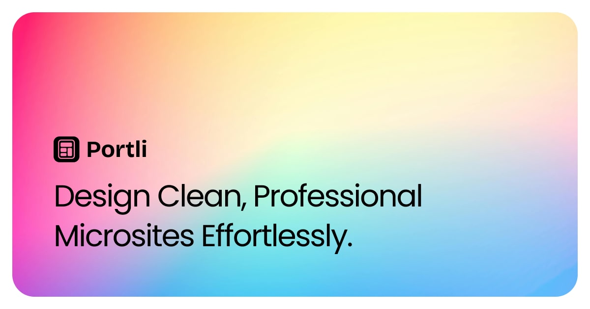
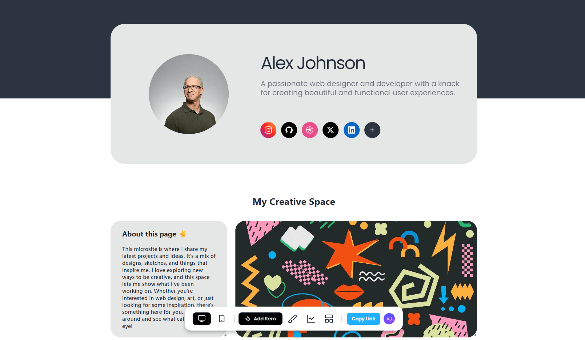

---

# Portli

Portli is a micro site or page builder that allows users to create visually appealing and professional pages with ease. It provides a variety of customizable elements such as text boxes, links, images, and titles to help you build your personal or professional web presence. You can showcase your site using the link provided by Portli. This link can be accessed by anyone.

## Key Features

- **Drag-and-Drop Interface**: Easily add and arrange elements on your page.
- **Media Integration**: Embed images, videos, and links seamlessly.
- **Responsive Design**: Ensure your page looks great on all devices.
- **Shareable Link**: Showcase your site using a unique link that can be accessed by anyone.
- **SEO Optimized**: Ensure your page is search engine friendly.

## Coming Soon

We are constantly working to improve Portli. Here are some features that will be available soon:

- **Customizable Templates**: Choose from a variety of pre-designed templates to get started quickly.
- **Advanced Analytics**: Gain insights into your page's performance with detailed analytics.
- **Custom Domains**: Use your own domain name for a more personalized touch.

## Showcase

Here are some examples of what you can create with Portli:

- **Personal Landing Page**: Introduce yourself with a clean and professional layout.
  
- **Project Portfolio**: Highlight your projects with detailed descriptions and media.
- **Business Page**: Create a simple and effective online presence for your business.
- **Event Page**: Share event details and allow visitors to RSVP.
- Example Page: [Ammar](https://portli.vercel.app/ammar)

## Visit Our Site

Check out Portli and start building your page today: [Portli Website](https://portli.vercel.app)
